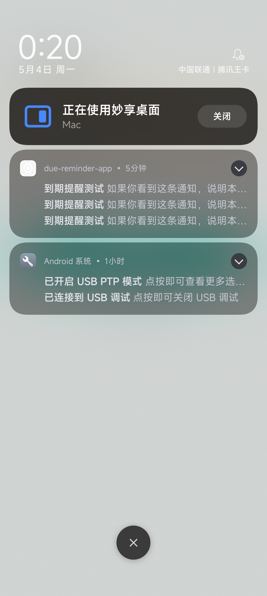
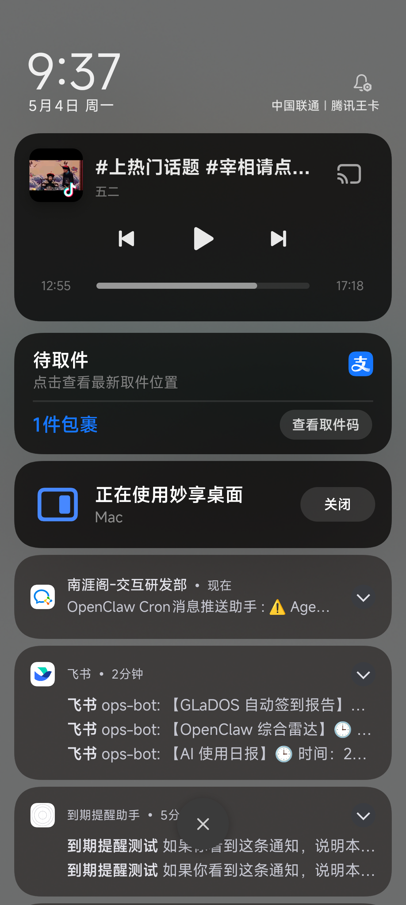

# Development Build 验证说明

> 最后更新：2026-05-04

本文件用于记录 `到期提醒助手` 的 Android development build 验证流程。M3 通知能力不能只依赖 Expo Go 验证，完整的通知权限、触达、取消和重排必须使用 development build 或正式包。

## 为什么需要 development build

1. Expo Go Android 从 SDK 53 起会对远程推送能力显示官方红色警告。
2. `expo-notifications`、`expo-dev-client` 和 config plugin 的原生部分需要重新编译到 App 包中。
3. 本地通知的真实表现依赖 Android 系统权限、通知 channel 和设备后台策略，必须在真实 Android 包里验证。

## 当前本机环境状态

2026-05-04 检查结果：

1. Node 和 npm 可用。
2. JDK 17 已安装：`/Library/Java/JavaVirtualMachines/temurin-17.jdk/Contents/Home`
3. Android Studio 已安装：`/Applications/Android Studio.app`
4. Android SDK 根目录：`/opt/homebrew/share/android-commandlinetools`
5. `ANDROID_HOME` 和 `ANDROID_SDK_ROOT` 已写入 `~/.zshrc`。
6. `adb` 可用，小米 14 真机已识别：

```bash
adb devices -l
```

当前设备：

```text
b69bc498 device usb:0-1.2 product:houji model:23127PN0CC device:houji
```

已安装的关键 SDK 包：

1. `platform-tools 37.0.0`
2. `platforms;android-35`
3. `build-tools;35.0.0`
4. `platforms;android-36`
5. `build-tools;36.0.0`
6. `ndk;27.1.12297006`
7. `cmake;3.22.1`

## 当前 Android 包信息

1. 正式维护包名：`com.henery.duereminderapp`
2. 当前 App 展示名称：`到期提醒助手`
3. 2026-05-04 首次本地验证包曾使用 Expo 自动生成包名 `com.anonymous.duereminderapp`。
4. 后续重新 clean prebuild / native build 时，应以 `app.json` 中的 `com.henery.duereminderapp` 为准。

## 推荐路径 A：EAS 云构建

适合当前机器还没有 Android Studio / JDK / SDK 的情况。

执行前注意：EAS 云构建会把项目上传到 Expo 构建服务，属于向第三方传输项目源码。后续运行前需要用户再次确认。

准备命令：

```bash
npm run eas:android:dev
```

预期结果：

1. 根据提示登录 Expo 账号。
2. 首次构建可能提示初始化 EAS 项目。
3. 构建成功后下载 APK。
4. 将 APK 安装到小米 14。
5. 运行 `npm run start:dev`，用 development build 连接 Metro。

## 路径 B：本地 Android 构建

适合后续长期开发，优点是调试闭环更快。

当前已完成安装和配置。后续日常验证优先使用本路径。

需要确认：

1. 小米 14 开启开发者选项
2. 开启 USB 调试
3. 开启 USB 安装
4. 开启 USB 调试（安全设置）

环境检查命令：

```bash
java -version
adb devices -l
```

本地构建命令：

```bash
npm run android:dev
```

若需要指定已连接真机：

```bash
npx expo run:android --device 23127PN0CC --port 8081
```

启动 JS 服务：

```bash
npm run start:dev
```

或：

```bash
npx expo start --dev-client --lan
```

若开发构建未自动连接 Metro，可先设置端口反向代理，再用 deep link 打开：

```bash
adb -s b69bc498 reverse tcp:8081 tcp:8081
adb -s b69bc498 shell am start -a android.intent.action.VIEW -d 'due-reminder-app://expo-development-client/?url=http%3A%2F%2F127.0.0.1%3A8081'
```

## 2026-05-04 真机构建与通知验证记录

本次采用路径 B：本地 Android 构建。

构建结果：

1. Debug APK 已生成：`android/app/build/outputs/apk/debug/app-debug.apk`
2. APK 已安装到小米 14。
3. development build 已连接本机 Metro。
4. 通知权限已授予，ADB 验证结果为 `POST_NOTIFICATION: allow`。
5. 点击「发送 5 秒测试通知」后，通知中心收到本地通知：
   - 标题：`到期提醒测试`
   - 正文：`如果你看到这条通知，说明本地提醒已经可以工作。`
6. 新建事项后，真机 SQLite 记录中的 `reminderRulesJson` 已写回 `notificationId`，说明系统调度调用返回成功。
7. 点击「已处理」后，事项状态变为 `done`，`completedAt` 写入，原 `notificationId` 被清空。
8. 点击「延后」后，事项状态变为 `snoozed`，旧通知 ID 被替换，并新增带 `notificationId` 的 snooze rule。

首次临时包名验证截图：



正式包名验证：

1. clean prebuild 后重新生成本地 `android/` 工程。
2. 本地 `android/local.properties` 需要写入 SDK 路径：

```properties
sdk.dir=/opt/homebrew/share/android-commandlinetools
```

3. 新包 `com.henery.duereminderapp` 已成功安装到小米 14。
4. 新包已连接 Metro，首页正常加载。
5. 新包通知权限已授予，ADB 验证结果为 `POST_NOTIFICATION: allow`。
6. 新包 5 秒测试通知已触达通知中心，通知 App 名显示为 `到期提醒助手`。

正式包名验证截图：



本次构建注意：

1. 初次 native 构建遇到 Maven Central TLS 访问不稳定，临时在生成的 `android/build.gradle` 中增加了阿里云 Maven 镜像。
2. 当前 `android/` 目录仍按 managed Expo 路线被 `.gitignore` 忽略，不提交生成的 native 工程。
3. 如果后续频繁遇到 Maven 拉取失败，优先考虑配置本机 Gradle 全局镜像，而不是提交生成的 `android/` 目录。
4. 不建议清理 Android SDK、Gradle 缓存和构建缓存；这些缓存能显著减少后续本地构建时间。

## M3 通知验证清单

1. 打开 development build 后，通知页不显示 Expo Go 限制提示。
2. 点击“开启通知权限”，Android 系统弹出通知权限申请。
3. 允许通知后，点击“发送 5 秒测试通知”，约 5 秒后收到本地通知。
4. 新建一个未来到期事项，确认提醒规则写入 `notificationId`。
5. 点击“已处理”，确认旧通知被取消，并且本地规则清空 `notificationId`。
6. 点击“延后”，确认旧通知取消，新的 snooze rule 被调度并写入新 `notificationId`。
7. 后台或锁屏状态下重复验证测试通知触达。

## 当前边界

1. Expo Go 仍可用于 UI 和基础数据流验证，但不作为通知完整验证环境。
2. 5 秒测试通知已在小米 14 development build 中验证通过。
3. 当前尚未实现事项编辑页和删除入口，因此编辑/删除场景的通知取消和重排还未验证。
4. 小米 / Android 后台策略可能影响长时间通知触达，后续需要单独记录机型策略。
5. 本次已验证前台/通知中心触达、创建事项写回 `notificationId`、已处理清空 `notificationId`、延后重排 `notificationId`。
6. 后台或锁屏状态下的长时间定时提醒仍需补测。
7. 旧临时包 `com.anonymous.duereminderapp` 仍安装在手机上，确认不再需要后可清理。
